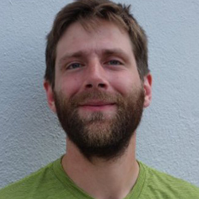
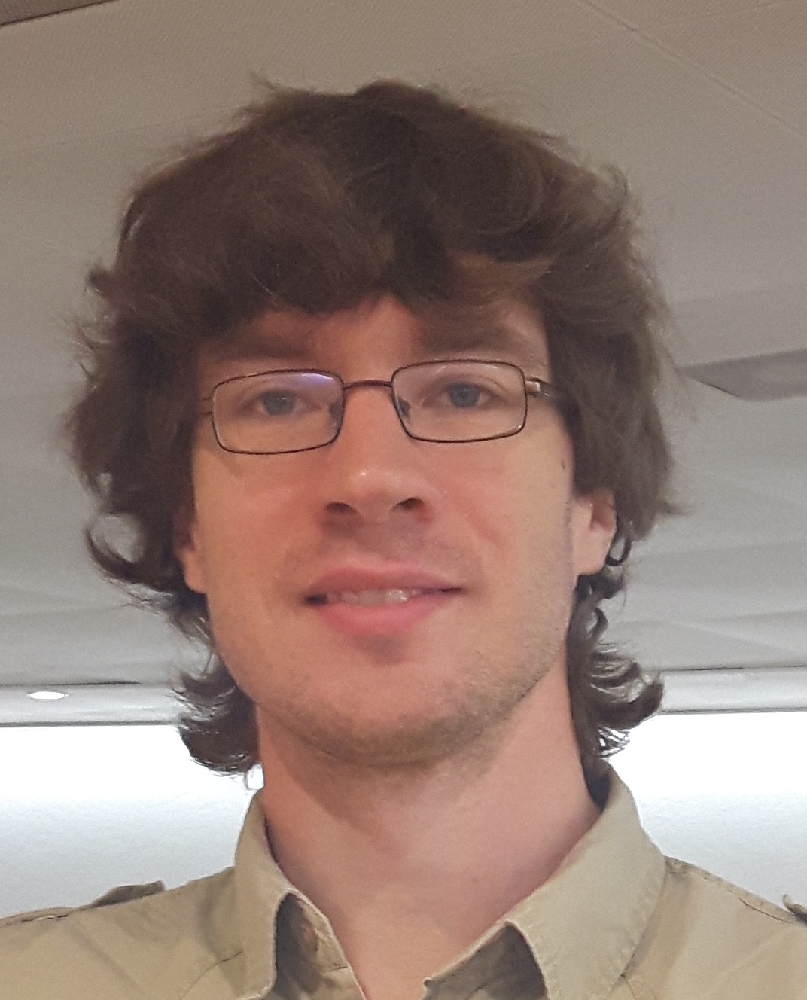

### Erik Garrison
**Affiliation:** University of California, Santa Cruz, US

[Erik Garrison](http://hypervolu.me/~erik/erik_garrison.html)s a Postdoctoral fellow at the University of California,Santa Cruz. His research has focused on the development of a software toolkit for practical pangenomics: [vg](https://github.com/vgteam/vg).

He has eight years of experience in genomics, where he has worked on the development of sequencing systems, participated in large scale sequencing projects such as the [1000 Genomes Project](http://www.internationalgenome.org/), and authored popular bioinformatics software such as the [freebayes](https://github.com/ekg/freebayes) variant caller. 

Raised in Kentucky, Erik obtained an undergraduate degree in the social sciences from Harvard University. After graduation he worked at Harvard Medical School, One Laptop Per Child, and Boston College before beginning his studies at the Sanger Institute.

 

---

### Mikko Rautiainen
**Affiliation:** Max Planck Institute for Informatics

Mikko Rautiainen is a PhD student at the Max Planck Institute for Informatics. His doctoral work consists of theoretical and practical work on graph genomes and various related topics, with a focus on read alignment to graphs.

 His research includes projects such as genome assembly, read error correction and RNA expression quantification. He is the author of [GraphAligner](https://github.com/maickrau/GraphAligner), a tool for aligning third generation sequencing reads such as Pacific Biosciences or Oxford Nanopore reads to sequence graphs.

 He graduated from the University of Helsinki with a masters degree in computer science, has worked professionally for three years as a software developer and now studies for a doctorate in bioinformatics at Saarbruecken.

 

### Back

Back to [main page](../index.md).
